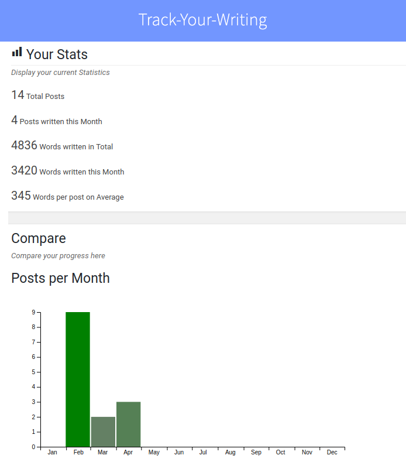
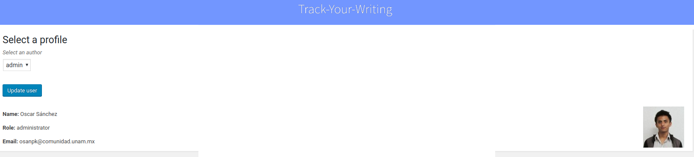

# track-your-writing

Track your writing tracks your most important writing data, ready to be challenged and beaten up. Level up your letter game!

**Contributors:** [oscarssanchez](https://profiles.wordpress.org/oscarssanchez)  
**Tested up to:** 4.9  
**Tags:** [plugin](https://wordpress.org/plugins/tags/widget)  
**License:** [GPLv2 or later](http://www.gnu.org/licenses/gpl-2.0.html)  
**Requires PHP:** 5.4 

# Description 

Track yourwriting sparkles the author's interest to start writing more
often and with higher quality by showing you your own progress. It can show the progress of multiple authors,
so if you have a website with multiple collaborators, everybody knows how well (or bad!) they are performing.

# Screenshots

  

# Installation

* Upload the folder to your /wp-content/plugins/ directory  
* Activate the plugin through the 'Plugins' menu in WordPress

## Changelog ##

* 0.1 Release
    